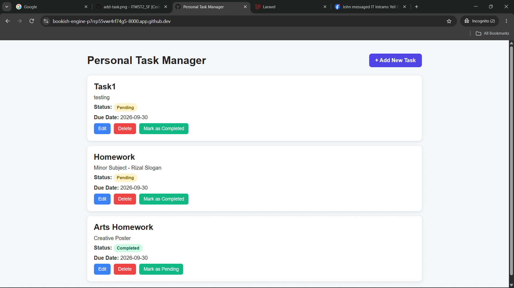
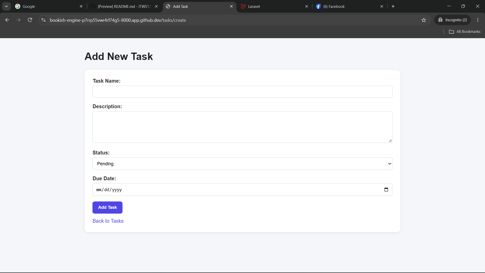
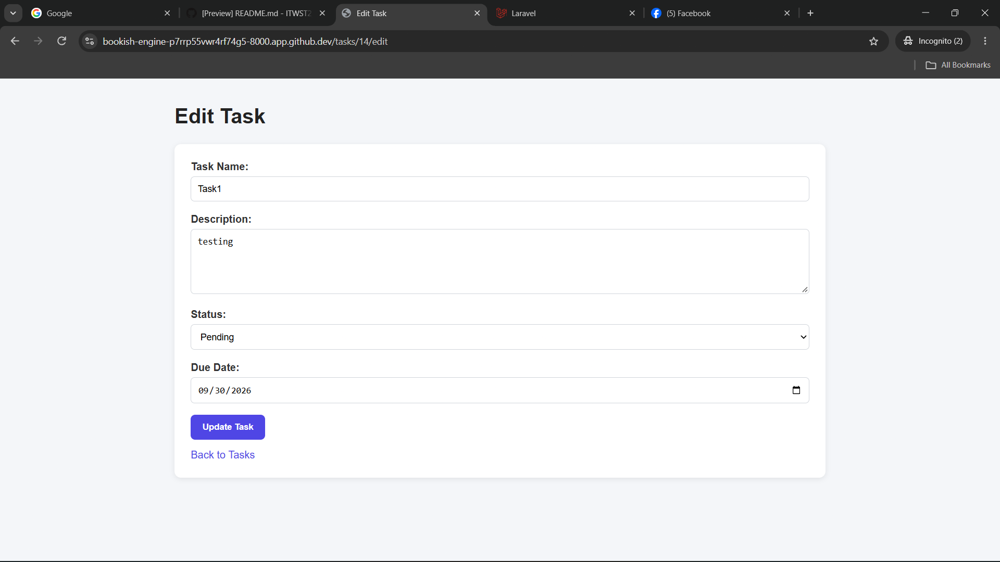

Project Code: WST21-PM-2026-SF
____________________________________________________________________________________________
Student Name: Lepiten, Bryle Azhbrent G.
____________________________________________________________________________________________
Course & Year: BSIT-2
____________________________________________________________________________________________
Database Used: MySQL
____________________________________________________________________________________________
Features:
- Add Task
- View Tasks
- Edit Task
- Delete Task
- Update Status
____________________________________________________________________________________________
Screenshots:

____________________________________________________________________________________________
How it Works:

Step 1: Open the Application/Browser
    The home page displays the list of tasks stored in the database.

Step 2: Add Task
    The user clicks Add New Task and enters the task name, description, status, and due date.

Step 3: View Tasks
    After adding a task, the task appears on the main task list.

Step 4: Edit a Task
    The user can click Edit on an existing task. The application opens the edit page and displays the current task information.

    After making changes and clicking Update Task, the updated information is saved to the database.

Step 5: Update Task Status
    Each task has a status of Pending or Completed.

    The user can click the Update Status button to change the task status.

Step 6: Delete a Task

    The user can click Delete to remove a task.

